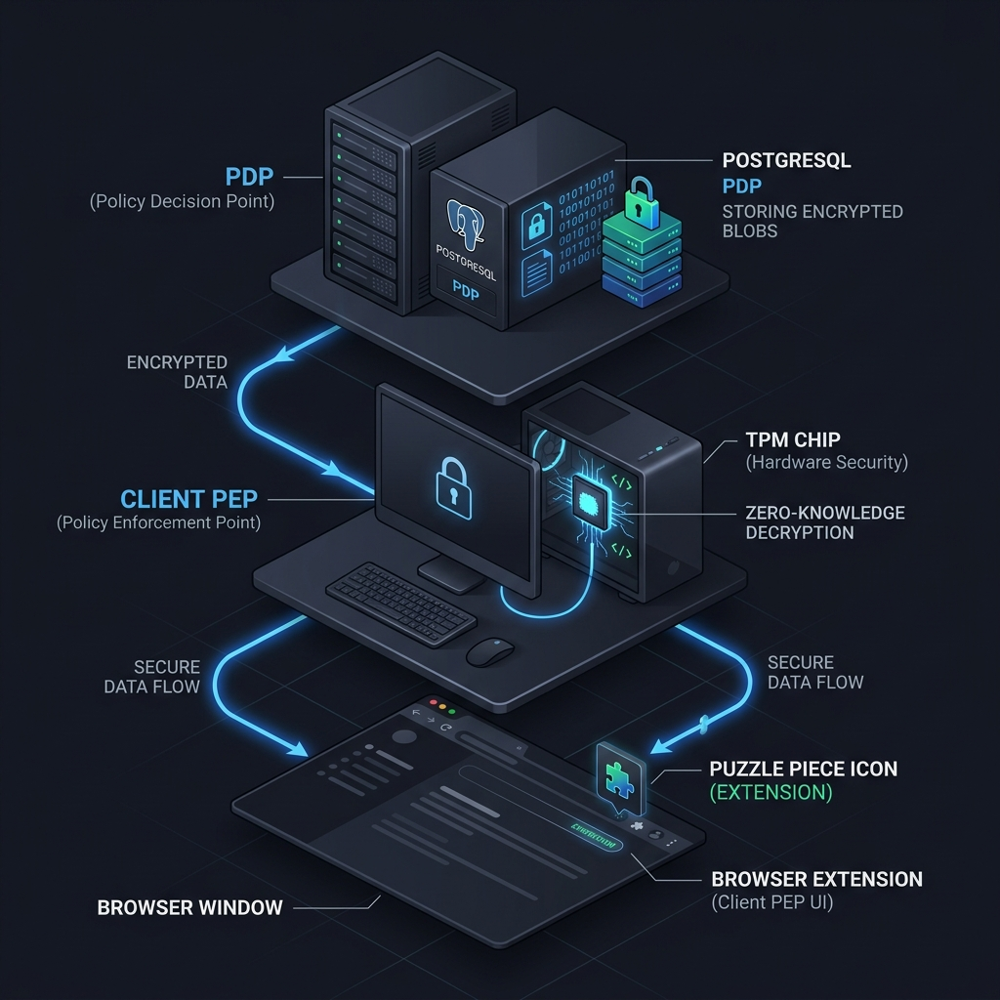

# System Overview & Architecture

EZKPM is not a standard password manager. It is specifically designed for enterprise environments using Active Directory, combining seamless usability with uncompromising, verifiable security.

## The Zero-Knowledge Principle

Traditional password managers often encrypt your data but store the encryption keys in a way that the server can access them, or they rely heavily on the server to manage permissions.

**In EZKPM:**
- **The Server (PDP - Policy Decision Point)** is completely blind. It only stores heavily encrypted blobs and hashed identifiers. It can never decrypt your vault.
- **The Client (PEP - Policy Enforcement Point)** handles all cryptography locally in your computer's RAM. 
- Passwords are only decrypted **Just-In-Time (JIT)** when you actively need them, and are immediately wiped from memory using `CryptographicOperations.ZeroMemory` to prevent RAM-scraping malware or forensic dumps from stealing them.

## Component Topology

1. **EZKPM Server (.NET Core / PostgreSQL)**
   - Manages Active Directory synchronization.
   - Enforces Role-Based Access Control (RBAC) at the network layer (e.g., verifying if you are allowed to download a specific encrypted blob).
   - Serves as a distribution point for Vault updates.

2. **EZKPM Desktop Client (.NET Avalonia)**
   - The core engine running securely on your machine.
   - Operates in the background (Headless Mode).
   - Protects local secrets using the Windows TPM (Trusted Platform Module) and DPAPI (Data Protection API) tied to your Windows session.
   - Acts as a local proxy (`Native Messaging Host`) for browsers.

3. **Browser Extension (Manifest V3)**
   - Installed in Chrome or Edge.
   - Does **not** store passwords and does **not** communicate with the server.
   - Uses an encrypted Local Pipe to ask the Desktop Client for credentials to autofill forms. 

## Cryptographic Foundation

EZKPM uses a **Hybrid Post-Quantum Cryptography** model:
- **Symmetric Encryption:** AES-256-GCM (used for the actual vault contents like passwords).
- **Asymmetric Encryption (Key Wrapping):** X25519 combined with Kyber/ML-KEM (Post-Quantum) to securely exchange keys between users (e.g., when sharing a folder) without the server intercepting them.
- **Identity & Signatures:** Ed25519 signatures ensure that every change in the vault was genuinely made by the authorized user, not manipulated by a rogue server admin.
