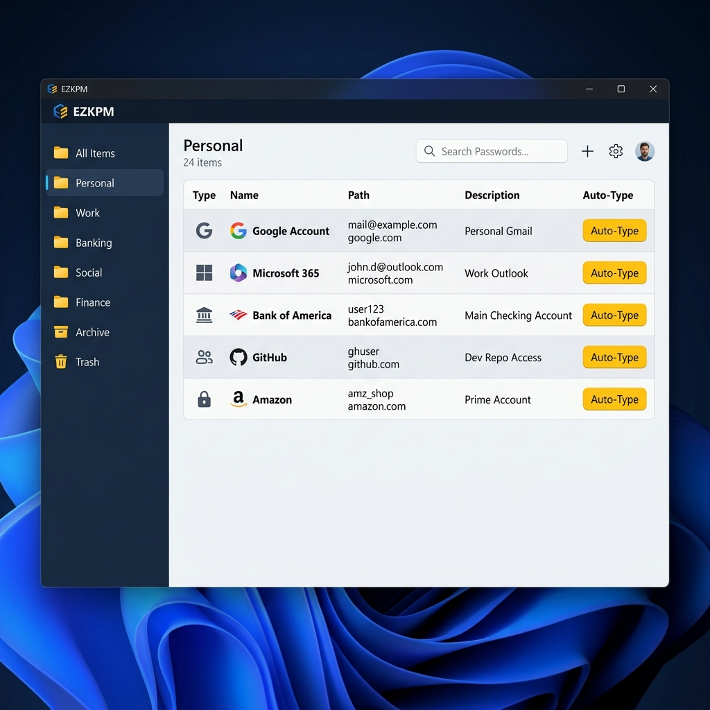

# User Guide

This guide covers the day-to-day usage of EZKPM for standard end-users.

## 1. Initial Device Setup & Seamless SSO

EZKPM is designed to be completely invisible during your daily routine if you are using your company Windows device.

**First Run (Bootstrapping):**
When you start EZKPM for the very first time on a new Windows computer, you will see the **Setup Window**. 
1. The app automatically detects your Active Directory (Windows) Login.
2. It generates a highly secure cryptographic vault for you.
3. You will be shown a **34-character Setup Code** (e.g., `EZ-ABCD...`). 
   - *Important:* This code is your ultimate fallback key if you lose access to this computer or want to add a smartphone. You should copy it and store it safely (e.g., print it).
4. Click **"Kopieren & Weiter"** to enter the app.

**Daily Use (Zero-Touch Login):**
Because EZKPM integrates with Windows DPAPI and your TPM chip, you **do not** need to type a Master Password every day. As long as you are logged into Windows with your domain account, EZKPM automatically and securely decrypts your vault in the background.

## 2. Navigating the Vault

The main UI consists of a left sidebar (Folders) and a main content area (Assets).

### Managing Folders
- Click **"Neuer Ordner"** (New Folder) to create a structure.
- Folders can be nested using Drag & Drop.
- **Sharing:** Folders can be assigned AD groups. If you drag an asset into a shared folder, EZKPM will seamlessly perform *Asymmetric Key Wrapping* in the background so that all members of the target group can decrypt the password.

### Creating Assets
Click **"Neuer Eintrag"** (New Asset) to store credentials. EZKPM supports:
- **Logins:** Username, Password, URL.
- **Passkeys:** Secure, passwordless FIDO2 credentials.
- **Payment:** Credit cards, PayPal accounts.
- **Secure Notes:** Free-form encrypted text.
- **SSH/SSL Keys:** Infrastructure certificates.
- **API Keys / Authenticators (TOTP):** For 2FA codes.

## 3. The Security Timer (Step-Up Authentication)

If you leave your computer or minimize the app for more than 10 minutes (or if you explicitly close it to the system tray), the UI enters a **Locked State**.

When you try to view a plain-text password, the **Native Windows Credential Prompt** will appear. You must enter your Windows password or use Windows Hello (PIN/Fingerprint) to prove you are still sitting at the computer. This ensures nobody can walk up to your unlocked PC and export your passwords.

## 4. Payment Asset Auditing

Payment assets (Credit Cards) are strictly protected by **FA 22 (Mandatory Logging)**.
If you try to autofill or copy a payment credential, a Topmost-Dialog will appear.
You MUST enter:
- The Purchase Amount (Betrag)
- The Order ID / Reason (Bestellnummer)

These details are cryptographically hashed and chained, then permanently stored in the unalterable Server Audit Log. This ensures absolute traceability for corporate expenses.
