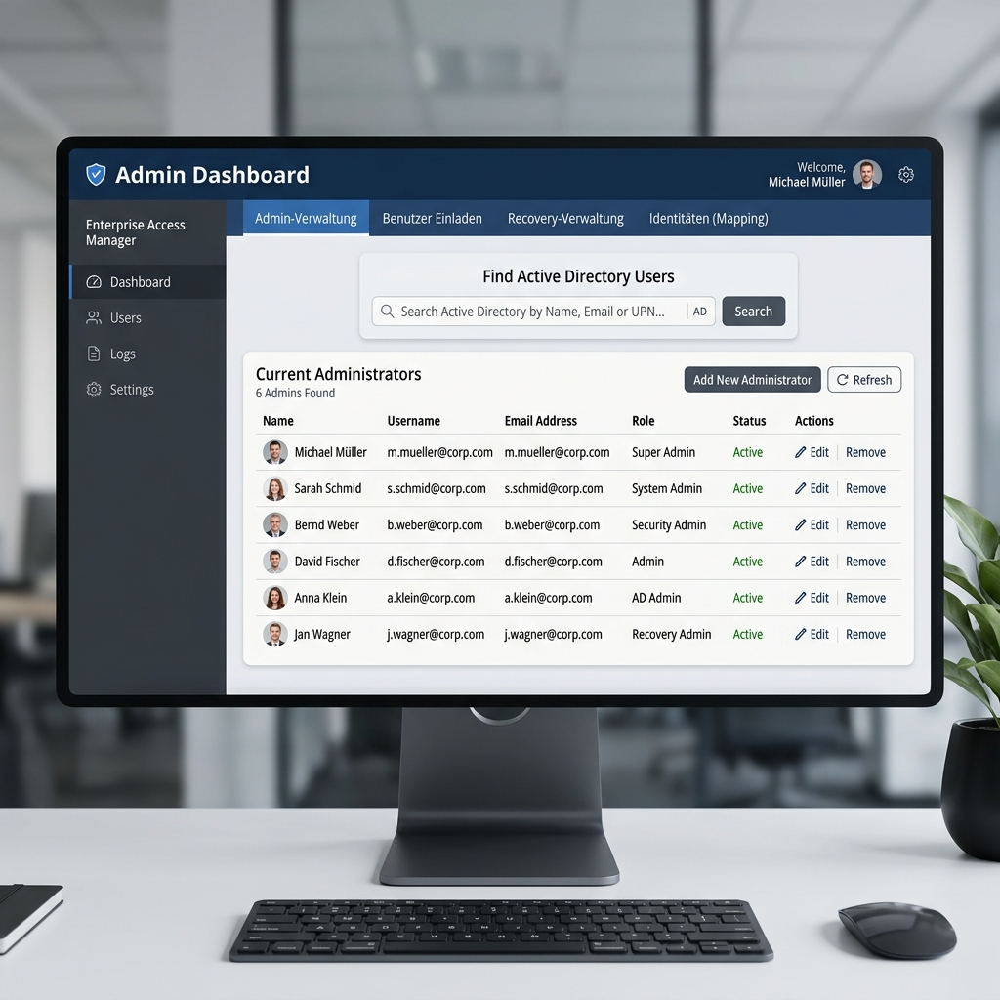

# Administrator Guide

This section is dedicated to IT Administrators managing the EZKPM infrastructure.

## 1. Accessing the Admin Dashboard
The Admin Dashboard is only visible to users whose Active Directory SID is registered as a Global Administrator on the EZKPM Server. If you are an admin, you will see a prominent **"🛡️ Admin & Recovery"** button in the left sidebar.

## 2. Active Directory Integration & RBAC

EZKPM does not maintain its own user list. Everything is tied to the central Active Directory (AD). 
- **Roles:** Permissions are assigned to Folders by mapping them to AD Group SIDs.
- **Role Types:**
  - `Owner`: Can read, edit, delete, and rotate passwords.
  - `Read`: Can view and use passwords.
  - `Execute-Only`: (Enterprise feature) Can use the password via the Browser Extension for Autofill, but cannot view the plaintext password in the UI or copy it to the clipboard.

## 3. Separation of Duties (Identity Mapping)
For highly privileged IT personnel, it is common to have a standard account (e.g., `kh`) and an admin account (e.g., `adm-kh`).
In the Admin Dashboard under **"Identitäten (Mapping)"**, you can link these two AD accounts together. This ensures that the system recognizes both accounts as the *same physical person*. This is crucial for enforcing the **6-Eyes-Principle** (Separation of Duties), preventing an admin from approving their own recovery request using their secondary account.

## 4. Mass-Rollout & Invitations
Under the **"Benutzer Einladen"** tab, you can perform Bulk SMTP rollouts.
1. Select an AD Group (e.g., "All Employees").
2. The EZKPM Server generates unique pairing codes for each user.
3. The Desktop Client orchestrates an automated background email blast via your corporate SMTP server.
4. Users receive a personalized welcome email with download instructions and their initial pairing code.

## 5. Security Alerts & Vulnerability Scans
The **"Sicherheitswarnungen"** tab aggregates CVEs (Common Vulnerabilities and Exposures) detected in software packages where you store credentials. For example, if a stored Server Asset uses a specific version of a web service that becomes compromised, EZKPM will alert the administrators here.

## 6. Audit Logs & Forensic Decryption
As mandated by **FA 4.2 / FA 22**, the system maintains a kryptografically hash-chained Audit Log.
Under **"System Keys & Logs"**, Admins possessing the `Environment Log Key` can download encrypted logs from the server and decrypt them locally to trace usage (e.g., finding out who accessed a payment card and what justification they provided).
